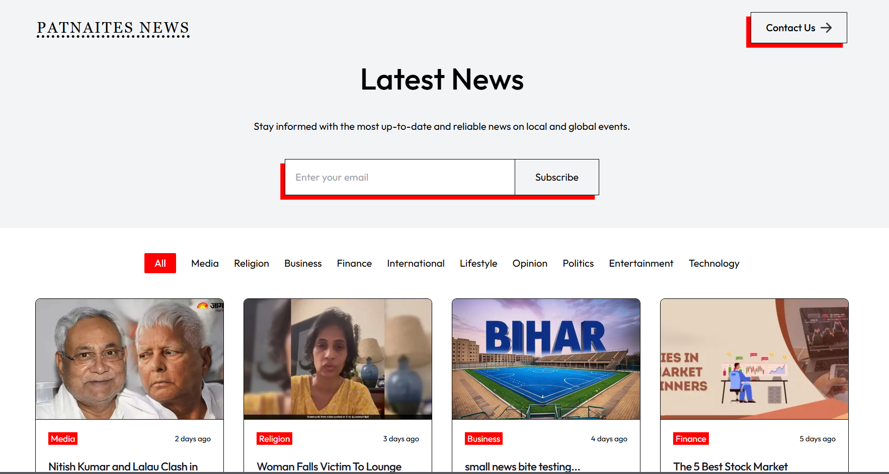

# PatnaitesNews



PatnaitesNews is a dynamic, SEO-friendly news website created using Next.js with Server-Side Rendering (SSR) functionality. Designed for a client, it offers real-time updates and a seamless user experience for readers, ensuring timely and relevant news content.

## Features

- **Next.js with SSR**: Optimized for faster page loads and better SEO.
- **SEO-Friendly**: Structured with SEO best practices to improve search engine visibility.
- **Dynamic Content**: Delivers real-time updates for fresh news content.
- **User-Focused Design**: A streamlined and intuitive interface for an enhanced user experience.

## Installation

1. Clone the repository:
   ```bash
   git clone https://github.com/anshumansinha2001/patnaitesnews.git
   ```
2. Navigate into the project directory:
   ```bash
   cd patnaitesnews
   ```
3. Install the dependencies:
   ```bash
   npm install
   ```

## Usage

1. Start the development server:
   ```bash
   npm run dev
   ```
2. Open [http://localhost:3000](http://localhost:3000) to view it in your browser.

## Deployment

PatnaitesNews is optimized for deployment on platforms that support Next.js SSR, such as Vercel. Follow standard Next.js deployment procedures to get the project live.

## Contributing

Contributions are welcome! Please fork the repository and create a pull request with your changes.

## License

This project is licensed under the MIT License.

```

PatnaitesNews: Bringing you real-time news updates with a smooth, user-friendly experience!

```
